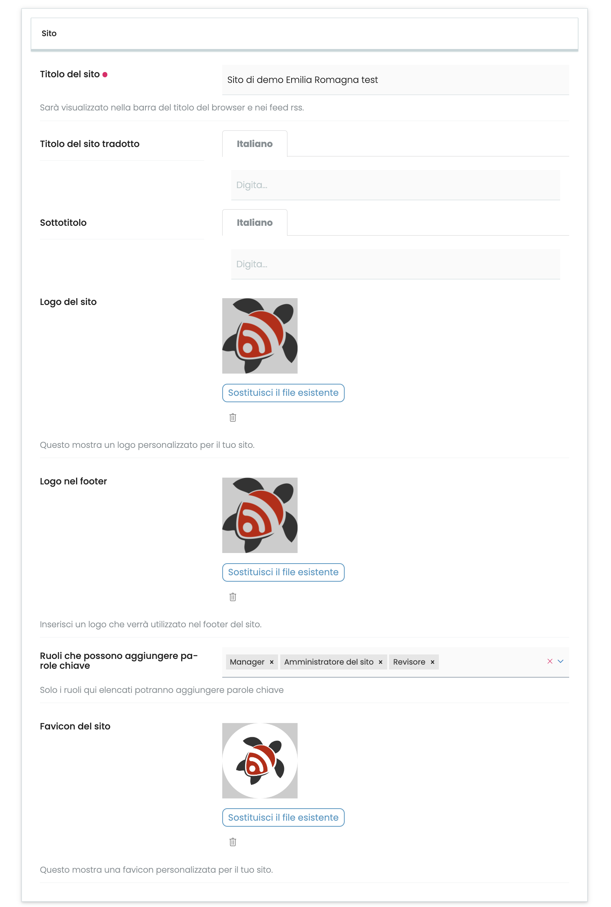

# volto-site-settings

## Introduction

> **Note**: This add-on currently needs [collective.volto.sitesettings](https://github.com/collective/collective.volto.sitesettings) to be installed in order to work.

This addon enable user to change and translate:

- site title
- site subtitle

and to change:

- site logo
- site footer logo
- site favicon

from control panel

and sets page title template with current site title.
If [volto-subsites](https://github.com/collective/collective.volto.subsites) is installed, it calculates site-title and site logo if you are under a subsite.



## Usage

```bash
yarn add volto-site-settings
```

Use SiteProperty component to get site properties:
For example, to get site title:

```jsx
import { SiteProperty } from 'volto-site-settings';
const title = SiteProperty = ({
  property = 'site_title',
  getValue: true
});
```

or

```jsx
import { SiteProperty } from 'volto-site-settings';
<SiteProperty property="site_title" />;
```

or to get logo:

```jsx
import { SiteProperty } from 'volto-site-settings';
import logo from './logo.png';

<SiteProperty
  property="site_logo"
  defaultValue={{ url: logo, width: 82, height: 82 }}
  className="icon"
  alt={alt}
/>;
```

## Contributing

Contributions are welcome, feel free to [open an issue](https://github.com/collective/volto-site-settings/issues) or submit a PR.

This project uses the conventional changelog specification (see [COMMITLINT.md](./COMMITLINT.md)).

## License

This product is licensed under the [MIT License](./LICENSE).

## Authors

This product was developed by the [RedTurtle Technology](https://www.redturtle.it) team.


